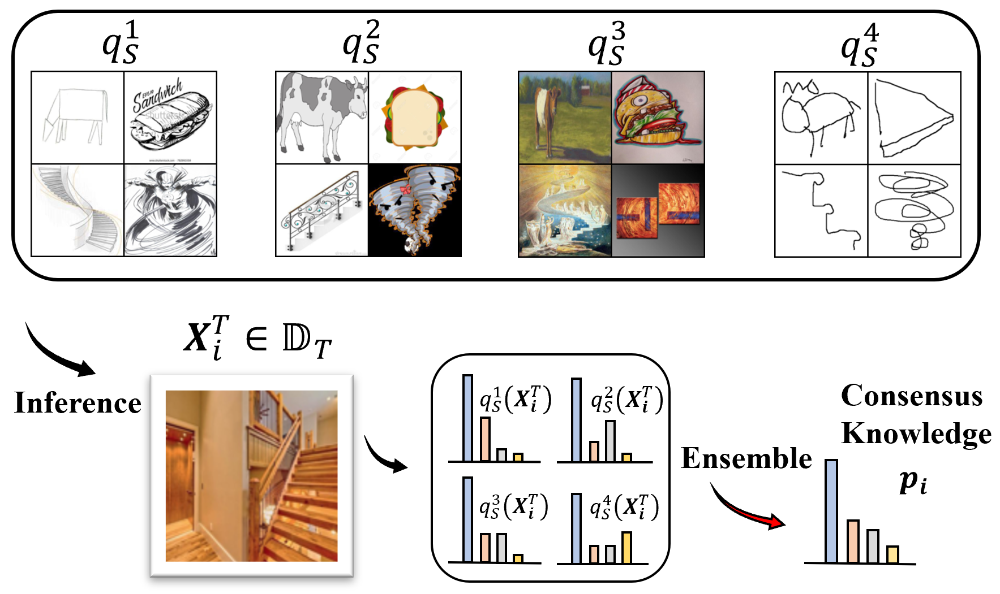
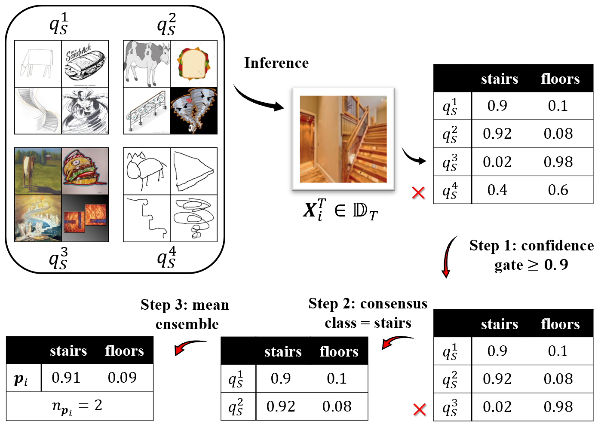
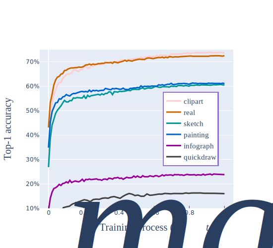
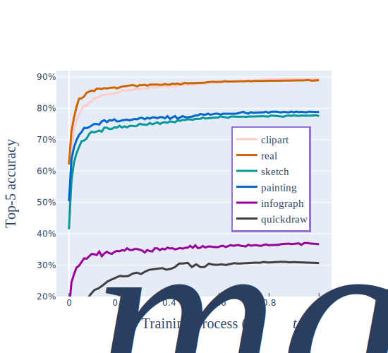

# KD3A: Unsupervised Multi-Source Decentralized Domain Adaptation via Knowledge Distillation (Accepted at ICML 2021)
Here is the official implementation of the model `KD3A` in paper [KD3A: Unsupervised Multi-Source Decentralized Domain Adaptation via Knowledge Distillation](https://arxiv.org/abs/2011.09757).


## Model Review
* Knowledge Distillation
  
  

* Knowledge Vote
  
  

## Setup
### Install Package Dependencies
```
Python Environment: >= 3.6
torch >= 1.2.0
torchvision >= 0.4.0
tensorbard >= 2.0.0
numpy
yaml
```
### Install Datasets
We need users to declare a `base path` to store the dataset as well as the log of training procedure. The directory structure should be
```
base_path
│       
└───dataset
│   │   DigitFive
│       │   mnist_data.mat
│       │   mnistm_with_label.mat
|       |   svhn_train_32x32.mat  
│       │   ...
│   │   DomainNet
│       │   ...
│   │   OfficeCaltech10
│       │   ...
|   |   Office31
|       |   ...
|   |   AmazonReview
|       |   ...
└───trained_model_1
│   │	parmater
│   │	runs
└───trained_model_2
│   │	parmater
│   │	runs
...
└───trained_model_n
│   │	parmater
│   │	runs    
```
Our framework now support five multi-source domain adaptation datasets: ```DigitFive, DomainNet, AmazonReview, OfficeCaltech10 and Office31```.

* DigitFive
  
  The DigitFive dataset can be accessed in [Google Drive](https://drive.google.com/file/d/1QvC6mDVN25VArmTuSHqgd7Cf9CoiHvVt/view?usp=sharing).

* DomainNet
  
  [VisDA2019](http://ai.bu.edu/M3SDA/) provides the DomainNet dataset.

* AmazonReview
  
  The AmazonReview dataset can be accessed in [Google Drive](https://drive.google.com/file/d/1QbXFENNyqor1IlCpRRFtOluI2_hMEd1W/view?usp=sharing).


### Unsupervised Multi-source Domain Adaptation
The configuration files can be found under the folder  `./config`, and we provide four config files with the format `.yaml`. To perform the unsupervised multi-source decentralized domain adaptation on the specific dataset (e.g., DomainNet), please use the following commands:

```python
python main.py --config DomainNet.yaml --target-domain clipart -bp base_path
```

The training process for DomainNet is as follows.

  

  

### Negative Transfer

In training process, our model will record the domain weights as well as the accuracy for target domain as 
```
Source Domains  :['infograph', 'painting', 'quickdraw', 'real', 'sketch']

Domain Weight : [0.1044, 0.3263, 0.0068, 0.2531, 0.2832]

Target Domain clipart Accuracy Top1 : 0.726 Top5: 0.902
```
* Irrelevant Domains
  
  We view quickdraw as the irrelevant domain, and the K3DA assigns low weights to it in training process.

* Malicious Domains
  
  We use the poisoning attack with level $m\%$ to create malicious domains. The related settings in the configuration files is as follows:
  ```
  UMDAConfig:
      malicious:
        attack_domain: "real"
        attack_level: 0.3
  ```
  With this setting, we will perform poisoning attack in the source domain `real` with $30\%$ mislabeled samples.

### Communication Rounds

We also provide the settings in `.yaml` config files to perform model aggregation with communication rounds $r$ as follows:
```
UMDAConfig:
    communication_rounds: 1
```
The communication rounds can be set into $[0.2, 0.5 , 1 , ... , N]$.

## Reference

If you find this useful in your work please consider citing:

```
@InProceedings{pmlr-v139-feng21f,
  title = 	 {KD3A: Unsupervised Multi-Source Decentralized Domain Adaptation via Knowledge Distillation},
  author =       {Feng, Haozhe and You, Zhaoyang and Chen, Minghao and Zhang, Tianye and Zhu, Minfeng and Wu, Fei and Wu, Chao and Chen, Wei},
  booktitle = 	 {Proceedings of the 38th International Conference on Machine Learning},
  pages = 	 {3274--3283},
  year = 	 {2021},
  editor = 	 {Meila, Marina and Zhang, Tong},
  volume = 	 {139},
  series = 	 {Proceedings of Machine Learning Research},
  month = 	 {18--24 Jul},
  publisher =    {PMLR}
}
```


  
